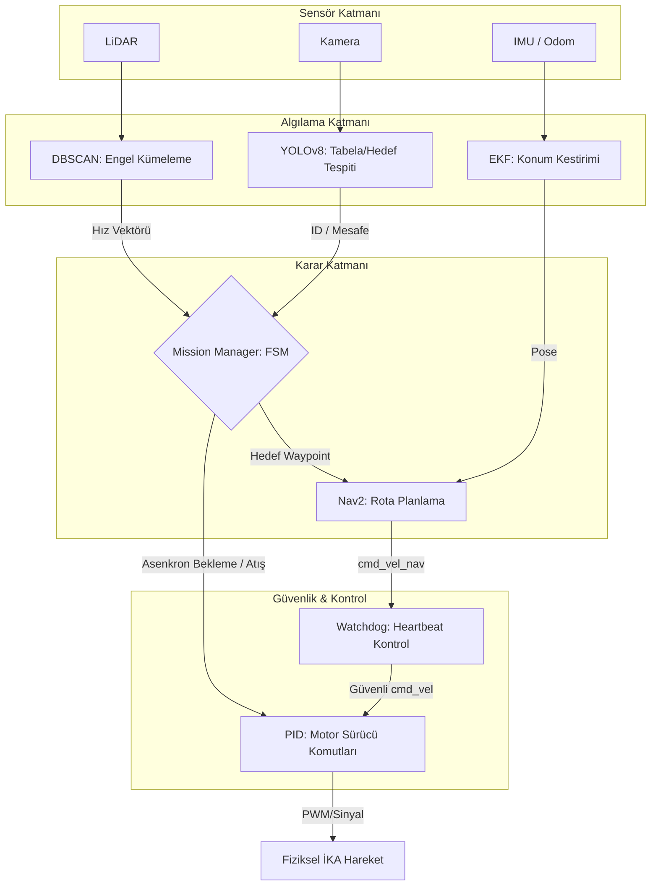

# PARSAV İKA 2026 - Otonom Sürüş Yazılımı


**Karabük Üniversitesi GM PARSAV İKA Takımı** tarafından TEKNOFEST 2026 İnsansız Kara Aracı Yarışması için geliştirilmiş **tam otonom sürüş yazılımıdır.**

## 🎯 Yarışma Uyumluluğu

Bu yazılım, TEKNOFEST 2026 İKA Şartnamesi'nin aşağıdaki kritik maddelerine **tam uyumlu** olarak tasarlanmıştır:

| Şartname Maddesi | Açıklama | Uygulama Durumu |
|------------------|----------|-----------------|
| 6.10 | Dik Eğimlerde 2 saniye bekleme | ✅ `WAIT_ON_SLOPE` durumu |
| 6.10 | Atış anında araç hareket kilidi | ✅ `FIRING` durumunda `cmd_vel` blokajı |
| 6.8 | Kayar Engel Dinamik Kaçınma | ✅ Engel hız vektörü tahmini + Nav2 entegrasyonu |
| 6.5 | Yan Eğim Stabilitesi | ✅ IMU geri bildirimi ile hız sınırlama |
| 6.3 | Su Geçişi ve Sensör Gürültüsü | ✅ EKF ile sensör füzyonu sayesinde dayanıklılık |
| 6.15 | Failsafe ve Acil Durdurma | ✅ 200 ms içinde güvenli duruş |

## 🧠 Sistem Mimarisi

Sistem, **ROS 2 Humble** üzerine inşa edilmiş modüler bir yapıya sahiptir:

- **`ika_mission_manager`**: Sonlu Durum Makinesi (FSM) ile görev yönetimi. Tüm yüksek seviye kararların merkezi.
- **`ika_perception`**: YOLOv8 ile tabela/hedef tanıma, DBSCAN ile LiDAR kümeleme.
- **`ika_description`**: Şartname ölçülerine birebir uygun URDF modeli.
- **`ika_gazebo`**: Kayar engel eklentisi dahil tam parkur simülasyonu.
- **`ika_bringup`**: Nav2, EKF ve tüm sistem başlatma konfigürasyonları.

## 📊 Sistem Akış Şeması (Flowchart)



## 🛠️ Kurulum

```bash
# Çalışma alanını oluştur
mkdir -p ~/ika_ws/src
cd ~/ika_ws/src
git clone https://github.com/kdrhanegrilmez/parsav_ika_otonom_2026.git .

# Bağımlılıkları yükle
cd ~/ika_ws
rosdep install --from-paths src --ignore-src -r -y
pip3 install ultralytics opencv-python numpy scikit-learn
```

## 🚀 Çalıştırma

```bash
# Derle
colcon build --symlink-install
source install/setup.bash

# Başlat
ros2 launch ika_bringup ika.launch.py
```

## 📦 Jetson Deployment

NVIDIA Jetson Orin Nano üzerinde GPU desteği ile çalıştırmak için:

```bash
# Docker Build
docker build -t parsav-ika:latest -f Dockerfile.jetson .

# Run
docker run --runtime nvidia --network host -it parsav-ika:latest
```

## 📂 Dosya Yapısı
```text
ika_ws/src/
├── ika_interfaces/       # Özel ROS 2 mesaj tanımları
├── ika_description/      # URDF modeli ve launch dosyaları
├── ika_gazebo/           # Simülasyon dünyası ve eklentiler
├── ika_perception/       # YOLO, LiDAR işleme düğümleri
├── ika_mission_manager/  # FSM tabanlı görev yöneticisi
├── ika_bringup/          # Ana başlatma ve konfigürasyon
├── docs/                 # Teknik dokümantasyon ve planlar
└── Dockerfile.jetson     # Jetson Orin Nano imajı
```
